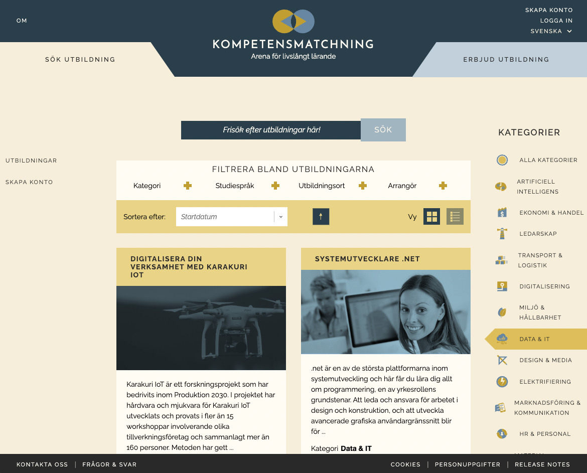

# Competence Hub

This a platform meant to function as a web-based market place for competence development, concerning further education for professionals, initially targeting western Sweden and industries undergoing transformation.  
The application handles users, educational course metadata, educational inquiries and educational organizations.  
The main function is to help educational organizations register/present their offerings, as well as letting professionals in need of increasing their competence to search for, and register interest in, educational resources. Educational metadata can be automatically downloaded from external sources, given a compatible import translator.



This repo is an outcome of a pilot within a Swedish [research project](https://www.vinnova.se/p/pilot-digital-infrastruktur-kll/), funded by Sweden's innovation agency. It is a proof-of-concept looking at issues surrounding digital cooperation and infrastructure within the context of professional education / skills development.

This repo is managed by RISE Reseatch Insititutes of Sweden, area of Lifelong Learning, contact [@ollenyman](https://github.com/ollenyman) at [support@kompetensmatchning.se](mailto:support@kompetensmatchning.se).

## [Backend](/backend)
|||
|---|---|
|Language / Framework|C# / [.NET 6.0](https://learn.microsoft.com/en-gb/dotnet/)|
|Libraries|[ASP.NET](https://dotnet.microsoft.com/apps/aspnet)|
||[Microsoft Entity Framework 6.0](https://docs.microsoft.com/en-us/ef/core/get-started/?tabs=netcore-cli)|
||[Hotchocolate v12](https://chillicream.com/)|
||[postmarkapp](https://postmarkapp.com/)|
|API|[GraphQL](https://graphql.org/)|
||[REST](https://en.wikipedia.org/wiki/Representational_state_transfer)|
||JSON-LD schema.org|
|Database|[Postgres](https://www.postgresql.org/)|
|Authentication|[Keycloak](https://www.keycloak.org/)|
|Container| [Docker](https://www.docker.com/)|

[See more](/backend)

## [Frontend](/frontend)
|||
|---|---|
|Language|JavaScript, HTML, SASS|
|Framework|[ReactJS](https://reactjs.org/

[See more](/frontend)

## Quick start

### Startup

The quick way to start up the platform requires installing [Docker](https://docs.docker.com/get-docker/), and then using the supplied compose file.
```
docker compose up
```
<details>
  <summary>Currently, if you're on arm64 (e.g. Apple M1) click here!</summary>

The ready-made image used for keycloak is not currently supporting arm64, so either build one yourself or use our overloaded compose file:

```
docker compose -f docker-compose.yml -f arm64.yml up
```
</details>

and visit [http://localhost:8000/](http://localhost:8000/) for web interface,  
and [http://localhost:8080/](http://localhost:8080/) for keycloak interface (see .env file for credentials).

A default admin user will be created with username "admin" and password "default". These credentials can be changed by logging in to keycloak using the credentials specified in the .env file.

### Import courses

Currently set up for scheduled night runs - see backend/Program.cs  
To trigger manually
- Go to graphql web tool at [http://localhost:8000/graphql/index.html](http://localhost:8000/graphql/index.html)
- Login by entering query
```
mutation{login(username:"admin@example.com",password:"default")}
```
- Start import from SUSA-navet by entering
```
mutation {external_import(method:SUSA_NAVET)}
```

## Contributing

Please read [CONTRIBUTING.md](CONTRIBUTING.md) for details on working with the project.

## License

[European Union Public Licence (EUPL)](https://joinup.ec.europa.eu/collection/eupl/news/understanding-eupl-v12)
